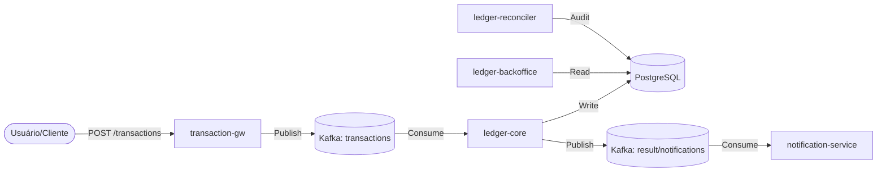
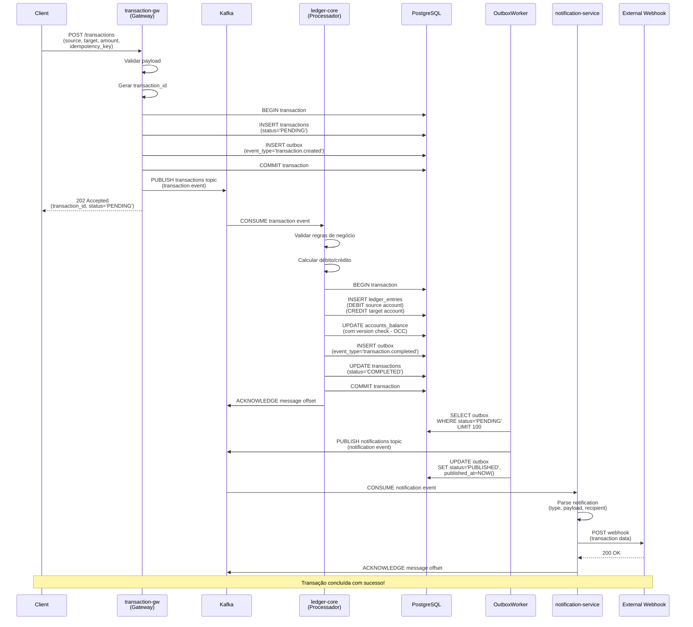
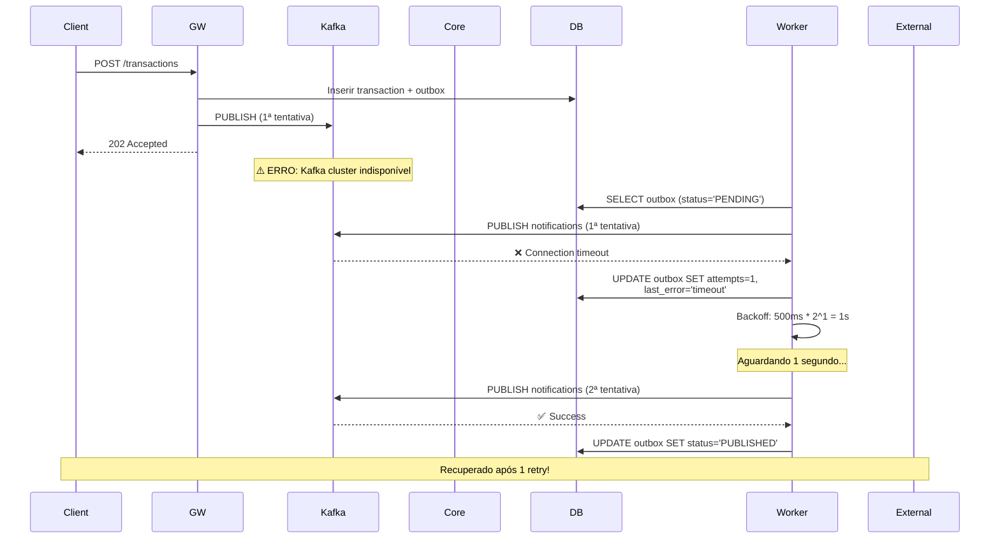
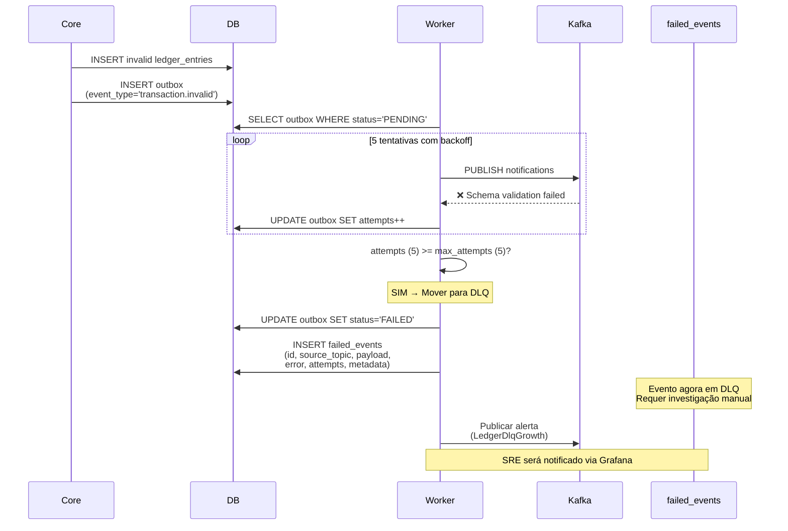
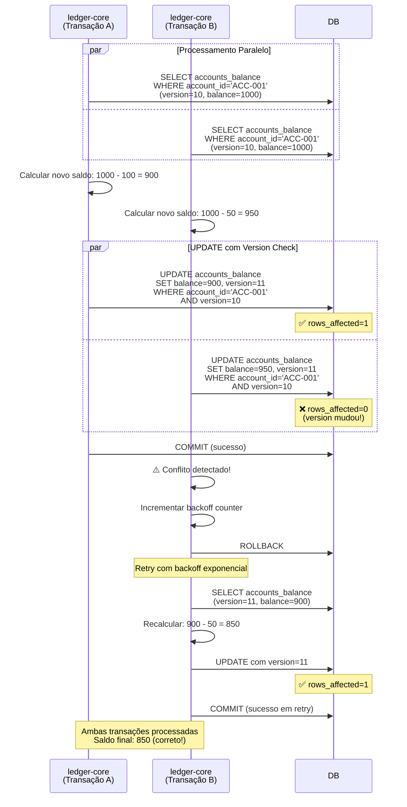
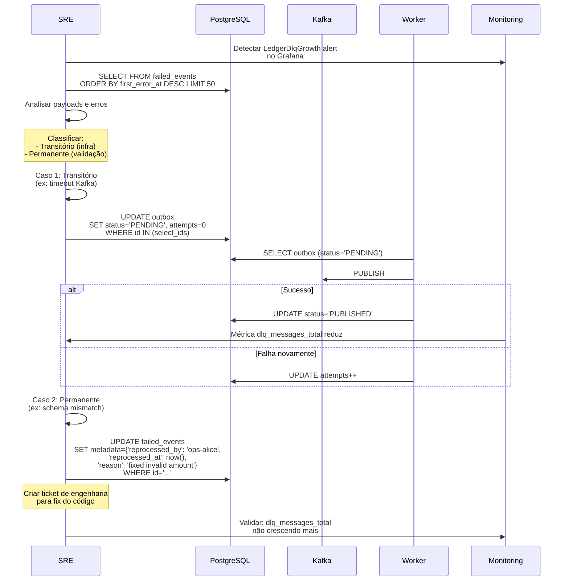
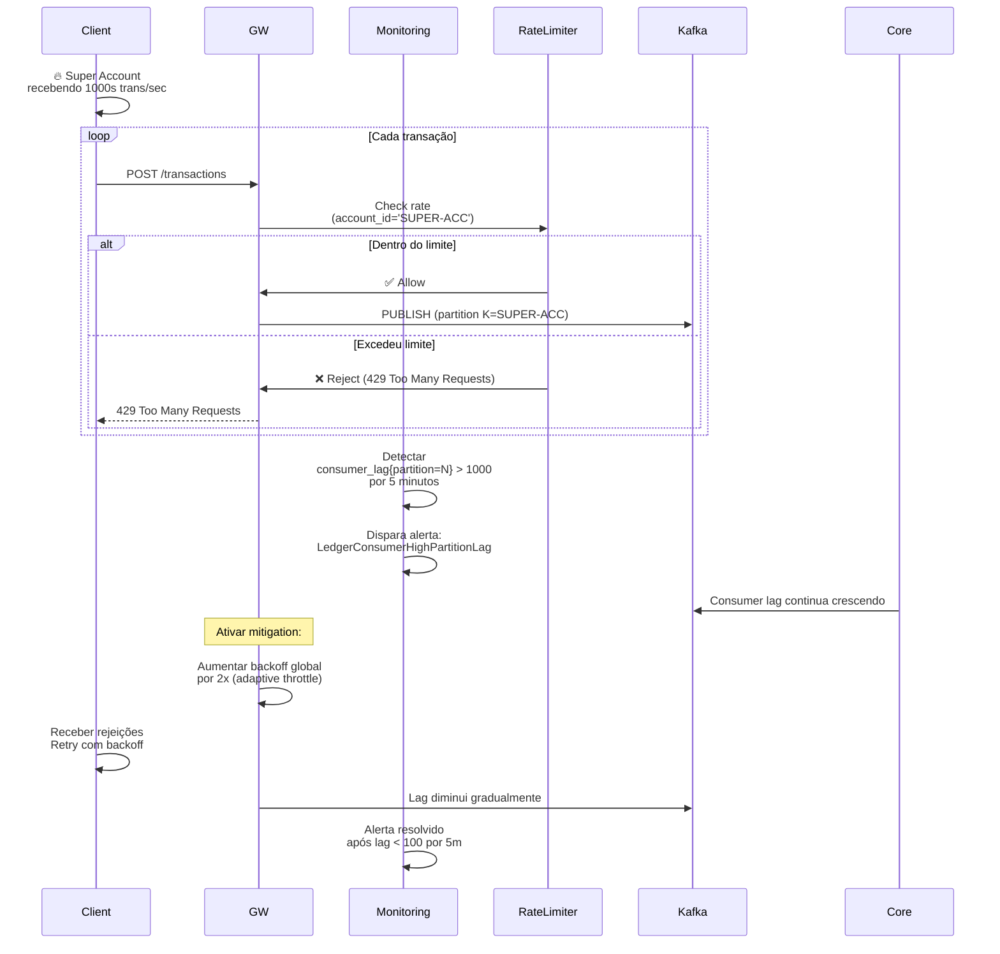
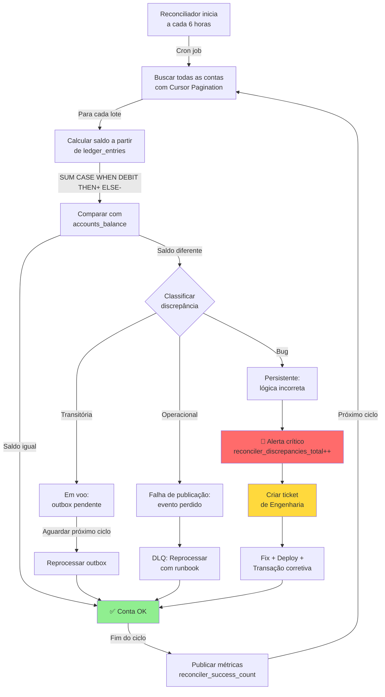
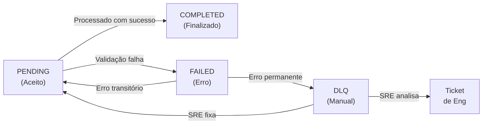

# System Design — Distributed Ledger (Consolidado)

Status: Aprovado pelo Staff (Acionável)
Proprietário: Staff Engineering
Última atualização: 2026-06-23

Objetivo

Este design de sistema consolidado é a referência técnica canônica para engenharia e SRE. Contém arquitetura, modelo de dados (DDL), contratos de eventos, parâmetros operacionais (idempotência, retry/DLQ), SLOs e runbooks curtos.

1) Arquitetura de alto nível



- API / Gateway de Transação (`transaction-gw`): valida requisições, canonicaliza a `idempotency_key`, escreve a linha de `transactions` + `outbox` dentro da mesma transação de banco de dados.
- Rate limiter: Baseado em Redis com contadores atômicos via script e fallback local.
- Broker: Tópicos Kafka (`transactions`, `transaction_result`, `notifications`, `<topic>-dlq`). Chaveamento padrão por `account_id` para preservar a ordenação por conta.
- Processador (`ledger-core`): consome `transactions`, aplica regras de domínio, escreve `ledger_entries`, atualiza `accounts_balance` (concorrência otimista) e persiste linhas de outbox para eventos a jusante.
- Worker de Outbox: publica linhas de `outbox` no Kafka, marca como `PUBLISHED` ou `FAILED`. Em falhas repetidas, escreve em `failed_events`.
- Serviço de Notificação (`notification-service`): consome eventos de `notifications` e encaminha para provedores externos (Webhooks, E-mail, Push).
- Backoffice (`ledger-backoffice`): interface administrativa para consulta de saldos, extratos e gestão de contas, acessando diretamente a réplica de leitura do banco de dados.
- Reconciliador (`ledger-reconciler`): job em lote que calcula saldos a partir de `ledger_entries` e os compara com `accounts_balance`.

2) Modelo de dados central (trechos de DDL)

Transações (Transactions)

```sql
CREATE TABLE transactions (
  id UUID PRIMARY KEY,
  idempotency_key VARCHAR(255) UNIQUE NOT NULL,
  description TEXT,
  status VARCHAR(20) NOT NULL DEFAULT 'COMPLETED',
  metadata JSONB,
  created_at timestamptz NOT NULL DEFAULT now(),
  updated_at timestamptz NOT NULL DEFAULT now()
);
```

Lançamentos de Ledger (Ledger entries)

```sql
CREATE TABLE ledger_entries (
  id UUID PRIMARY KEY,
  transaction_id UUID NOT NULL REFERENCES transactions(id),
  account_id UUID NOT NULL,
  entry_type VARCHAR(10) NOT NULL CHECK (entry_type IN ('DEBIT','CREDIT')),
  amount_in_cents BIGINT NOT NULL CHECK (amount_in_cents > 0),
  created_at timestamptz NOT NULL DEFAULT now()
);
CREATE INDEX idx_ledger_entries_account_created ON ledger_entries (account_id, created_at DESC);
```

Saldo das Contas (Accounts balance - projeção)

```sql
CREATE TABLE accounts_balance (
  account_id UUID PRIMARY KEY,
  balance_in_cents BIGINT NOT NULL DEFAULT 0,
  version BIGINT NOT NULL DEFAULT 0,
  updated_at timestamptz NOT NULL DEFAULT now()
);
```

Outbox e eventos com falha

```sql
CREATE TABLE outbox (
  id UUID PRIMARY KEY,
  aggregate_type VARCHAR(100) NOT NULL,
  aggregate_id UUID NULL,
  event_type VARCHAR(100) NOT NULL,
  payload JSONB NOT NULL,
  status VARCHAR(20) NOT NULL DEFAULT 'PENDING',
  attempts INT NOT NULL DEFAULT 0,
  last_error TEXT NULL,
  created_at timestamptz NOT NULL DEFAULT now(),
  published_at timestamptz NULL
);

CREATE TABLE failed_events (
  id UUID PRIMARY KEY,
  source_topic VARCHAR(255),
  payload JSONB NOT NULL,
  error TEXT NOT NULL,
  attempts INT NOT NULL DEFAULT 0,
  first_error_at timestamptz NOT NULL DEFAULT now(),
  last_error_at timestamptz NOT NULL DEFAULT now(),
  metadata JSONB NULL
);
```

3) Contratos de eventos (resumo)

- Use registro de esquemas (Avro/Protobuf/JSON Schema). Adicione `schema_version` nos headers e imponha compatibilidade via CI.
- Chaveie mensagens por `source_account_id` para garantir a ordenação por conta.

Tópico de Transações (intenção)

```json
{
  "id": "tx-123",
  "source_account_id": "acc-A",
  "target_account_id": "acc-B",
  "amount": 2500,
  "idempotency_key": "req-abc",
  "description": "Transferência simples",
  "created_at": "2026-06-23T21:40:19Z"
}
```

Resultado da Transação (Notificação)

```json
{
  "id": "not-123",
  "type": "transaction_processed",
  "target": "acc-A",
  "payload": "Transação de R$ 25.00 processada com sucesso."
}
```

4) Parâmetros operacionais

- Idempotência: `idempotency_key` obrigatória para todas as requisições de transação externas. Imposta no nível do banco de dados (`UNIQUE`). TTL sugerido = 30 dias (Pendente de confirmação por Produto/Compliance).
- Política de Retry: `max_attempts = 5`, `initial_backoff = 500ms`, `multiplier = 2`, `max_backoff = 30s` + jitter.
- DLQ: mover para `<topic>-dlq` e inserir em `failed_events` após exceder os retries. Retenção sugerida = 90 dias (Pendente de confirmação).

5) Modelo de consistência

- Use transações locais fortes para atualizações financeiras: insira `transactions`, `ledger_entries` e a linha de `outbox` de forma atômica.
- Use concorrência otimista (`version`) para atualizações de `accounts_balance`.
- Evite transações distribuídas; conte com o padrão outbox para consistência eventual entre serviços.

6) Observabilidade e SLOs

- Métricas a expor: `transactions_processed_total`, `transactions_processed_errors_total`, `transaction_processing_duration_seconds`, `outbox_pending`, `dlq_messages_total`, `consumer_lag{topic,partition}`, `reconciler_discrepancies_total`, `transaction_rate_by_account`.
- SLOs sugeridos: 99,9% das transações processadas em < 2s; 99,99% de disponibilidade do serviço.

7) Runbooks (resumo)

- Reprocessamento de DLQ: reprocessar pequenos lotes via `FOR UPDATE SKIP LOCKED`; anexar metadados `reprocessed_by` e parar se a taxa de erro a jusante aumentar além do limite.
- Partições quentes (hot partitions): detectar via `consumer_lag` por partição; dimensionar consumidores, aplicar throttling por conta, considerar sharding/subcontas para contas muito ativas.
- Reconciliador: processamento baseado em cursor em blocos, classificar discrepâncias (transitórias/operacionais/bug) e criar tickets de remediação ou transações corretivas.

8) Governança e ciclo de vida

- Mudanças de esquema requerem: diff de esquema, validação de compatibilidade, plano de migração, plano de atualização de consumidores e verificações de CI. Publique artefatos canônicos em `shared/schema/`.
- Proprietários: API Guild para esquemas, Ledger Team para lógica central, SRE/Plataforma para runbooks/alertas, Produto/Compliance para retenção e SLAs.

9) Segurança e conformidade

- Mascarar PII em logs e dashboards. Use Vault para credenciais e controle de acesso para operações de reprocessamento.
- Manter trilha de auditoria: todas as escritas são apenas de acréscimo (append-only); correções apenas por transações de compensação.

10) Exemplos e padrões rápidos

- Inserção de transação idempotente:

```sql
INSERT INTO transactions (id, idempotency_key, status, metadata)
VALUES ($1, $2, 'PENDING', $3)
ON CONFLICT (idempotency_key) DO NOTHING
RETURNING id, status, created_at;
```

- Selecionar lote de outbox pendente com lock:

```sql
BEGIN;
SELECT id, payload FROM outbox WHERE status='PENDING' ORDER BY created_at LIMIT 100 FOR UPDATE SKIP LOCKED;
COMMIT;
```

11) Log de Decisões (Staff Engineering)

- Decisão: Chaveamento (Keying) por `account_id` no Kafka
  - Fundamentação: garante ordenação por conta
  - Ação: monitorar hot-partitions e criar playbook de sharding (Proprietário: Staff Eng, ETA: 1 sprint)

- Decisão: `idempotency_key` UNIQUE em `transactions`
  - Fundamentação: evita duplicidade financeira
  - Ação: implementar job de limpeza de TTL e documentar política de 30 dias (Proprietário: Ledger Team, ETA: 1 sprint)

- Decisão: Padrão Outbox + worker
  - Fundamentação: garantir publicação at-least-once sem bloquear transações
  - Ação: finalizar DDL e políticas de retry/DLQ (Proprietário: Plataforma, ETA: 1 sprint)

- Decisão: Multi-moeda adiada
  - Fundamentação: reduzir escopo inicial
  - Ação: criar épico `multi-currency` com opção de mitigação de hot-partition e análise de sharding (Proprietário: Produto + Staff, ETA: Q4 planning)

12) Padrões de Arquitetura e Código

- **Arquitetura Hexagonal (Ports & Adapters):** Todos os serviços devem isolar a lógica de negócio (core/domain) de preocupações externas (HTTP, Kafka, Postgres). Isso facilita testes unitários e trocas de infraestrutura.
- **SOLID:** Princípios de responsabilidade única e inversão de dependência são mandatórios para garantir a manutenibilidade do monorepo.
- **Tratamento de Erros:** Erros devem ser tipados e contextuais, utilizando `fmt.Errorf` com wrap (`%w`) e verificados com `errors.Is` ou `errors.AsType`.

---

Este `system-design.md` condensado deve ser lido junto com `business.md` e `dev-team.md` para planejamento, implementação e operações.

Guias Detalhados:
- [Guia de Idempotência](reference/idempotency-guide.md)
- [Guia de Observabilidade](reference/observability.md)
- [Contratos Técnicos](reference/technical-contracts.md)
- [Política Operacional e de Conformidade](reference/operational-compliance-policy.md)
# Estrutura do Monorepo — Distributed Ledger Go

**Status:** Documentação Centralizada (2026-06-24)
**Proprietário:** Staff Engineering
**Objetivo:** Servir como referência única para arquitetura, layout e organização do monorepo

---

## Índice Rápido

- [Visão Geral](#visão-geral-da-arquitetura)
- [Layout do Monorepo](#layout-do-monorepo)
- [Microserviços](#microserviços-e-componentes)
- [Camadas & Padrões](#camadas--padrões-arquiteturais)
- [Convenções](#convenções-de-código-e-diretórios)
- [Como Expandir](#como-expandir-o-monorepo)

---

## Visão Geral da Arquitetura

O projeto **Distributed Ledger Go** é um ecossistema completo de ledger distribuído, orientado a eventos, implementado seguindo rigorosamente:

- **Arquitetura Hexagonal (Ports and Adapters):** lógica de negócio independente de frameworks, BDs, protocolos
- **SOLID Principles:** single responsibility, open/closed, Liskov substitution, interface segregation, dependency inversion
- **Clean Architecture:** separação clara entre camadas (domain, application, infrastructure)
- **Event-Driven Architecture:** comunicação assíncrona via Kafka, garantias de entrega eventual

**Stack Tecnológica:**
- **Linguagem:** Go 1.22+
- **Mensageria:** Apache Kafka (com KRaft)
- **Banco de Dados:** PostgreSQL 16
- **Cache/Rate Limit:** Redis 7.2
- **Containerização:** Docker & Docker Compose

---

## Layout do Monorepo

```
/distributed-ledger-go
├── README.md                          Root documentation (this should point to /docs)
├── docker-compose.yml                 Full stack setup (Kafka, Postgres, Redis, Apps)
├── .github/
│   └── workflows/
│       ├── ci.yml                     CI/CD pipeline (build, test, lint)
│       └── release.yml                Release automation
├── apps/                              Microservices layer
│   ├── rate-limiter/                  HTTP Rate Limiter (Project 2)
│   │   ├── cmd/
│   │   ├── internal/
│   │   ├── go.mod
│   │   └── README.md
│   ├── transaction-gw/                HTTP API Gateway (Project 1)
│   │   ├── cmd/
│   │   ├── internal/
│   │   ├── go.mod
│   │   └── README.md
│   ├── ledger-core/                   Kafka Consumer (Project 1)
│   │   ├── cmd/
│   │   ├── internal/
│   │   ├── go.mod
│   │   └── README.md
│   ├── notification-service/          Event Consumer (Project 3)
│   │   ├── cmd/
│   │   ├── internal/
│   │   ├── go.mod
│   │   └── README.md
│   ├── ledger-reconciler/             Batch Auditor (Project 4)
│   │   ├── cmd/
│   │   ├── internal/
│   │   ├── go.mod
│   │   └── README.md
│   └── ledger-backoffice/             Admin Dashboard (Project 5)
│       ├── cmd/
│       ├── internal/
│       ├── web/                       HTML templates & static assets
│       ├── go.mod
│       └── README.md
├── shared/                            Shared packages (events, DTOs, infrastructure)
│   ├── contracts/                     Event contracts & schemas
│   │   ├── events.go                  Domain events
│   │   └── transaction_v1.go          Transaction event versioning
│   ├── schema/                        JSON schemas & validation
│   ├── models/                        DTOs & value objects
│   │   ├── transaction.go
│   │   └── ledger_entry.go
│   ├── clients/                       Infrastructure clients
│   │   ├── kafkaClient.go
│   │   ├── postgresClient.go
│   │   └── redisClient.go
│   ├── middleware/                    HTTP middleware (auth, logging, etc)
│   │   ├── errorHandler.go
│   │   └── correlation.go
│   ├── go.mod
│   └── README.md
├── migrations/                        Database migrations
│   ├── 01_initial_schema.sql
│   ├── 02_outbox_table.sql
│   └── 03_outbox_failed_events.sql
├── infra/                             Configurações de infraestrutura e deploy
│   └── observability/                 Prometheus, Grafana, Alertmanager
├── docs/                              Complete documentation
│   ├── README.md                      Documentation index
│   ├── QUICKSTART.md                  5-step onboarding
│   ├── ARCHITECTURE_FLOWS.md          8 Mermaid diagrams
│   ├── ERROR_HANDLING_PATTERNS.md     Error handling matrix + Go examples
│   ├── STRUCTURE.md                   This file
│   ├── system-design.md               Technical architecture
│   ├── business.md                    Business vision & SLAs
│   ├── dev-team.md                    Developer workflow
│   ├── reference/
│   │   ├── technical-contracts.md     API endpoints & events
│   │   ├── operational-compliance-policy.md  Unified policies
│   │   ├── idempotency-guide.md       Idempotency reference
│   │   ├── observability.md           Metrics & alerts
│   │   ├── faq.md                     Design decisions
│   │   └── shared-module.md           Shared package docs
│   └── playbooks/
│       ├── dlq-playbook.md            DLQ reprocessing runbook
│       └── operations-runbooks.md     Ops runbooks (lag, hot partitions, reconciliation)
└── .gitignore

```

---

## Microserviços e Componentes

### 1. Ledger Imutável Distribuído (`apps/ledger-core` + `apps/transaction-gw`)

**Responsabilidade:** Garantir consistência estrita dos saldos com double-entry bookkeeping

**Key Patterns:**
- **Append-Only:** Sem `UPDATE` ou `DELETE` em lançamentos — apenas `INSERT`
- **Integer Values:** Armazenamento em centavos (BIGINT) para evitar erros de ponto flutuante
- **Strict Ordering:** Chaveamento por `account_id` no Kafka para garantir sequencialidade por conta
- **Idempotency:** Uso de `idempotency_key` para garantir *At-Least-Once* delivery

**Fluxo de Transação:**
1. Client → `transaction-gw` (HTTP POST)
2. `transaction-gw` valida, gera `transaction_id`, escreve em `outbox` table
3. Outbox Worker publica em Kafka `transactions` topic
4. `ledger-core` consumer processa evento, aplica em `ledger_entries`
5. Se erro → Outbox marca como `FAILED`, DLQ captura para reprocessamento

**Banco de Dados:**
```sql
-- /migrations/01_initial_schema.sql
CREATE TABLE transactions (
  id UUID PRIMARY KEY,
  idempotency_key VARCHAR(255) NOT NULL UNIQUE,
  status VARCHAR(20),  -- PENDING, COMPLETED, FAILED
  created_at TIMESTAMP NOT NULL,
  ...
);

CREATE TABLE ledger_entries (
  id UUID PRIMARY KEY,
  transaction_id UUID REFERENCES transactions(id),
  account_id UUID NOT NULL,
  amount BIGINT NOT NULL,  -- in cents
  created_at TIMESTAMP NOT NULL,
  ...
);

CREATE TABLE outbox (
  id UUID PRIMARY KEY,
  aggregate_type VARCHAR(50),
  aggregate_id UUID,
  event_type VARCHAR(50),
  payload JSONB,
  status VARCHAR(20),  -- PENDING, PUBLISHED, FAILED
  created_at TIMESTAMP NOT NULL,
  ...
);
```

---

### 2. Rate Limiter Distribuído Adaptativo (`apps/rate-limiter`)

**Responsabilidade:** Proteção contra exaustão de recursos com fallback local

**Key Patterns:**
- **Atomicidade:** Scripts Lua em Redis para evitar race conditions
- **Adaptive Limits:** Ajusta limites por conta baseado em histórico
- **Graceful Degradation:** Fallback para `sync.Map` em memória se Redis cair

**Integração:**
- Middleware HTTP em `transaction-gw`
- Protege ingress com tokens por account_id
- Retorna 429 (Too Many Requests) quando limite excedido

---

### 3. Notification Service (`apps/notification-service`)

**Responsabilidade:** Consumir eventos Kafka e enviar notificações (email, SMS, webhooks)

**Key Patterns:**
- **Worker Pool Pattern:** Pool fixo de goroutines para processar eventos
- **Exponential Backoff:** Retry com jitter para falhas transitórias
- **Circuit Breaker:** Proteção contra latência excessiva em provedores externos
- **At-Least-Once Semantics:** Commit offset após processamento bem-sucedido

**Tópicos Consumidos:**
- `transactions` — new transaction events
- `failed_events` — DLQ events para notificações de falha

---

### 4. Ledger Reconciliador (`apps/ledger-reconciler`)

**Responsabilidade:** Auditoria em batch para cura de eventual consistência

**Key Patterns:**
- **Cursor Pagination:** Varredura eficiente de tabelas massivas ($O(1)$ per batch)
- **Controlled Concurrency:** `errgroup` com limite máximo de workers
- **Idempotency:** Marcas de reconciliação para evitar reprocessamento

**Job Agendado:**
- Roda a cada hora (configurável)
- Verifica discrepâncias entre saldos esperados e observados
- Gera relatórios e alertas se inconsistências encontradas

---

### 5. Ledger Backoffice (`apps/ledger-backoffice`)

**Responsabilidade:** Dashboard administrativo e auditoria em tempo real

**Key Patterns:**
- **Server-Side Rendering:** Templates Go + Tailwind CSS
- **Audit Trail:** Inspeção imutável de transações por conta
- **System Health:** Monitoramento de DLQ e alertas de inconsistência

**Funcionalidades:**
- Visualizar saldo de qualquer conta
- Histórico completo de transações
- Status de DLQ e mensagens falhadas
- Reprocessamento manual de DLQ

---

## Camadas & Padrões Arquiteturais

### Hexagonal Architecture (Ports & Adapters)

Cada microserviço segue a estrutura abaixo dentro de `/internal`:

```
apps/ledger-core/internal/
├── domain/              ← Business logic (entities, value objects, use cases)
│   ├── ledger/
│   │   ├── ledger.go                (entity)
│   │   ├── entry.go                 (value object)
│   │   └── create_entry.go          (use case)
│   └── events/
│       └── transaction_created.go   (domain event)
├── application/         ← Application layer (services, DTOs)
│   ├── services/
│   │   └── transaction_service.go
│   └── dto/
│       └── transaction_dto.go
├── infrastructure/      ← Adapters (DB, Kafka, HTTP)
│   ├── persistence/
│   │   ├── postgres_repository.go
│   │   └── migrations.go
│   ├── messaging/
│   │   ├── kafka_consumer.go
│   │   └── kafka_publisher.go
│   └── http/
│       └── handler.go
└── shared/              ← Shared utilities
    ├── logger.go
    ├── errors.go
    └── middleware.go
```

### Key Principles

1. **Domain-Driven Design (DDD):**
   - Ubiquitous language
   - Bounded contexts (each app is a context)
   - Value objects vs entities

2. **SOLID:**
   - Single Responsibility: each file ~1 concern
   - Open/Closed: extensible without modification
   - Liskov Substitution: interfaces over implementations
   - Interface Segregation: small focused interfaces
   - Dependency Inversion: depend on abstractions

3. **Error Handling:**
   - Custom error types in `domain/` (e.g., `InvalidAmountError`)
   - Propagation via interface contracts
   - Log + alert + DLQ strategy (see `ERROR_HANDLING_PATTERNS.md`)

4. **Testing:**
   - Unit tests in `*_test.go` same package
   - Integration tests in `/test` folder
   - Mock interfaces for external dependencies

---

## Convenções de Código e Diretórios

### Naming Conventions

| Entity | Convention | Example |
|--------|-----------|---------|
| Go packages | lowercase, single word | `domain`, `infrastructure`, `ledger` |
| Go files | snake_case.go | `transaction_service.go` |
| Go interfaces | PascalCase + "er" suffix | `TransactionRepository` |
| Go structs | PascalCase | `Transaction`, `LedgerEntry` |
| Go functions | PascalCase | `CreateTransaction()` |
| Private functions | camelCase | `validateAmount()` |
| Constants | SCREAMING_SNAKE_CASE | `TRANSACTION_TIMEOUT_MS` |
| SQL tables | snake_case, plural | `transactions`, `ledger_entries` |
| SQL columns | snake_case | `transaction_id`, `created_at` |
| Kafka topics | kebab-case | `transactions`, `failed-events` |
| Docker containers | kebab-case | `ledger-core`, `transaction-gw` |
| Environment variables | SCREAMING_SNAKE_CASE | `DATABASE_URL`, `KAFKA_BROKERS` |

### Directory Conventions

- `/cmd/` — entry points (main.go for app, CLI tools)
- `/internal/` — private implementation (never imported by other apps)
- `/test/` — integration & contract tests
- `/web/` — static assets, HTML templates (for backoffice only)
- `/migrations/` — SQL migration scripts
- `shared/schema/` — JSON/Proto schemas

---

## Como Expandir o Monorepo

### Adicionar Novo Microserviço

**Step 1:** Criar estrutura
```bash
mkdir -p apps/my-service/internal/{domain,application,infrastructure}
mkdir -p apps/my-service/cmd
touch apps/my-service/go.mod
touch apps/my-service/go.sum
touch apps/my-service/cmd/main.go
```

**Step 2:** Inicializar módulo Go
```bash
cd apps/my-service
go mod init github.com/example/distributed-ledger-go/apps/my-service
go get github.com/example/distributed-ledger-go/shared
```

**Step 3:** Implementar domínio
```go
// apps/my-service/internal/domain/my_entity.go
package domain

type MyEntity struct {
  ID    string
  Value int
}

func (e *MyEntity) Validate() error {
  // validation logic
  return nil
}
```

**Step 4:** Implementar application service
```go
// apps/my-service/internal/application/my_service.go
package application

type MyService struct {
  repository Repository
}

func (s *MyService) DoSomething(ctx context.Context) error {
  // business logic
}
```

**Step 5:** Implementar adapters (HTTP, Kafka, DB)
```go
// apps/my-service/internal/infrastructure/http/handler.go
package http

func (h *Handler) POST(w http.ResponseWriter, r *http.Request) {
  // HTTP adapter
}
```

**Step 6:** Criar main.go
```go
// apps/my-service/cmd/main.go
package main

func main() {
  // initialize dependencies
  // start servers
}
```

**Step 7:** Adicionar ao docker-compose.yml
```yaml
services:
  my-service:
    build:
      context: .
      dockerfile: apps/my-service/Dockerfile
    environment:
      - DATABASE_URL=postgresql://...
      - KAFKA_BROKERS=kafka:9092
    depends_on:
      - postgres
      - kafka
```

---

## Padrões Comuns

### Error Handling

Veja [ERROR_HANDLING_PATTERNS.md](ERROR_HANDLING_PATTERNS.md) para detalhes.

```go
// Domain layer defines custom errors
type InvalidAmountError struct {
  Amount int64
}

func (e InvalidAmountError) Error() string {
  return fmt.Sprintf("invalid amount: %d", e.Amount)
}

// Application layer handles and propagates
func (s *Service) CreateTransaction(ctx context.Context, req *Request) error {
  if req.Amount <= 0 {
    return InvalidAmountError{Amount: req.Amount}
  }
  // ...
}

// Infrastructure layer logs, alerts, and sends to DLQ
if err != nil {
  log.Error("transaction failed", "error", err)
  if isTransient(err) {
    // retry
  } else {
    // send to DLQ
  }
}
```

### Idempotency

Veja [reference/idempotency-guide.md](reference/idempotency-guide.md) para detalhes.

```go
// Client provides idempotency_key
POST /transactions
X-Idempotency-Key: "client-generated-uuid-or-key"

// Service stores and checks
func (s *Service) CreateTransaction(ctx context.Context, req *CreateTransactionRequest) (*CreateTransactionResponse, error) {
  // Check if idempotency_key already exists
  existing, err := s.repo.GetByIdempotencyKey(ctx, req.IdempotencyKey)
  if err == nil {
    return existing, nil  // idempotent response
  }
  
  // Otherwise create new
  tx := &Transaction{
    ID:             uuid.New().String(),
    IdempotencyKey: req.IdempotencyKey,
    Status:         StatusPending,
  }
  
  return s.repo.Create(ctx, tx)
}
```

### Kafka Consumer Pattern

```go
// Consumer group setup
consumer, err := sarama.NewConsumer([]string{"kafka:9092"}, nil)
consumerGroup, err := sarama.NewConsumerGroup([]string{"kafka:9092"}, "ledger-core-group", nil)

// Handler
type Handler struct {
  service MyService
}

func (h *Handler) ConsumeClaim(session sarama.ConsumerGroupSession, claim sarama.ConsumerGroupClaim) error {
  for message := range claim.Messages() {
    var event TransactionEvent
    json.Unmarshal(message.Value, &event)
    
    if err := h.service.Handle(context.Background(), &event); err != nil {
      // log, alert, possibly send to DLQ
      return err
    }
    
    session.MarkMessage(message, "")
  }
  return nil
}

// Start consumer
go func() {
  for err := range consumerGroup.Errors() {
    log.Error("consumer error", "error", err)
  }
}()
```

---

## Links Relacionados

- **[QUICKSTART.md](QUICKSTART.md)** — Como começar rapidamente
- **[ARCHITECTURE_FLOWS.md](ARCHITECTURE_FLOWS.md)** — Diagramas de fluxo
- **[system-design.md](system-design.md)** — Design técnico profundo
- **[ERROR_HANDLING_PATTERNS.md](ERROR_HANDLING_PATTERNS.md)** — Padrões de erro
- **[dev-team.md](dev-team.md)** — Workflow do desenvolvedor
- **[reference/technical-contracts.md](reference/technical-contracts.md)** — APIs & eventos

---

**Documento criado:** 2026-06-24  
**Próxima revisão:** 2026-08-01  
**Proprietário:** Staff Engineering
# Architecture Flows — Diagramas de Fluxo End-to-End

**Propósito:** Visualizar o fluxo completo de uma transação através dos componentes do sistema, incluindo caminhos de sucesso, erro e recuperação.

**Última atualização:** 2026-06-24

---

## 1. Fluxo de Transação Bem-Sucedida (Happy Path)

Este é o cenário esperado quando uma transação é processada sem erros.



**Tempo total esperado:** < 2 segundos (SLA)

**Verificação de sucesso:**
- ✅ `transactions.status` = `COMPLETED`
- ✅ `ledger_entries` contém 2 registros (débito + crédito balanceados)
- ✅ `accounts_balance` atualizado para ambas as contas
- ✅ `outbox.status` = `PUBLISHED`
- ✅ Cliente recebe webhook de notificação

---

## 2. Fluxo de Erro Transitório (Retry com Sucesso)

Quando um componente falha temporariamente mas se recupera após retry.



**Parâmetros de retry:**
- `max_attempts` = 5
- `initial_backoff` = 500ms
- `backoff_multiplier` = 2
- `max_backoff` = 30s
- `jitter` = ±10% aleatório

**Quando isso acontece:**
- Kafka indisponível temporariamente
- Database connection pool esgotado
- Timeout de rede (network timeout)
- Rate limit temporário de webhook externo

---

## 3. Fluxo de Erro Permanente (Para DLQ)

Quando o erro persiste após max_attempts e a mensagem vai para Dead Letter Queue.



**Exemplo de erro permanente:**
- Schema mismatch (campo obrigatório faltando)
- Validação de negócio falha (saldo negativo)
- Conta de origem ou destino inválida
- Webhook externo retorna 410 Gone (cliente deletado)

**Operação manual necessária:**
- SRE investiga payload em `failed_events`
- Determina causa: bug no código vs dados ruins
- Se dados ruins: corrigir manualmente em metadata
- Se bug: fix, deploy, reprocessar

---

## 4. Fluxo de Conflito de Concorrência (OCC - Optimistic Concurrency Control)

Quando duas transações tentam atualizar a mesma conta simultaneamente.



**Garantia:** A version check (OCC) garante que não há "lost updates" — cada transação vê a versão correta da conta.

**Quando isso acontece:**
- Múltiplas transações na mesma conta
- Particularmente com hot accounts (contas muito ativas)
- Exemplo: Conta compartilhada recebendo múltiplos pagamentos

---

## 5. Fluxo de Reprocessamento de DLQ (Operacional)

Como um SRE/Ops reprocessa eventos que falharam.



**Runbook associado:** [`playbooks/dlq-playbook.md`](playbooks/dlq-playbook.md)

---

## 6. Fluxo de Hot Partition (Estrangulamento)

Como o sistema detecta e mitiga uma "hot partition" (uma partição Kafka recebendo muito tráfego).



**Quando ativar:**
- Consumer lag > 1000 por > 5m
- Taxa de erro > 1% durante > 10m
- `transaction_processing_duration_seconds` p95 > 5s

**Estratégias de mitigação:**
1. **Rate Limiting** — Throttle cliente (429 Too Many Requests)
2. **Sharding** — Splittar super account em subcontas
3. **Escalar consumers** — Adicionar mais replicas (se stateless)
4. **Reroute** — Enviar para partição alternativa (se suportado)

---

## 7. Fluxo de Reconciliação (Auditoria em Lote)

Como o reconciliador detecta e classifica discrepâncias.



**Tempos:**
- Cada ciclo: ~30 min (depende do volume)
- Detecção de discrepância: < 1h após acontecer
- Classificação: manual via SRE/Ops
- Resolução: 24h (SLA de negócio)

**Métricas:**
- `reconciler_cycles_total`
- `reconciler_discrepancies_total`
- `reconciler_cycle_duration_seconds`

---

## 8. Referência Rápida de Estados



**Estados por tabela:**

| Tabela | Status | Significado |
|--------|--------|-------------|
| `transactions` | PENDING | Em processamento |
| `transactions` | COMPLETED | Processada com sucesso |
| `transactions` | FAILED | Validação ou erro permanente |
| `outbox` | PENDING | Aguardando publicação no Kafka |
| `outbox` | PUBLISHED | Publicada com sucesso |
| `outbox` | FAILED | Excedeu max_attempts, movida para DLQ |
| `failed_events` | N/A | Evento permanentemente falhado |

---

## 9. Links para Documentação Detalhada

| Fluxo | Documentação |
|-------|--------------|
| Happy Path | `system-design.md` § 1) Arquitetura |
| Erro & DLQ | `playbooks/dlq-playbook.md` |
| OCC & Concorrência | `reference/faq.md` § 1) Consistência |
| Hot Partition | `playbooks/operations-runbooks.md` § 1) |
| Reconciliação | `reference/faq.md` § 3) Escalabilidade |
| Idempotência | `reference/operational-compliance-policy.md` § 3) |

---

## 10. Troubleshooting por Sintoma

| Sintoma | Provável Causa | Fluxo | Ação |
|---------|----------------|-------|------|
| Transação fica em PENDING | Processador não está rodando | 1 | Reiniciar ledger-core |
| Muitos eventos em DLQ | Bug no código ou schema inválido | 3 | Investigar failed_events |
| Consumer lag alto | Hot partition ou processador lento | 6 | Escalar consumers ou mitigar throttle |
| Discrepância de saldo | Outbox event perdido ou bug | 7 | Executar reconciliador |
| OCC conflict persistente | Muita contention na mesma conta | 4 | Considerar sharding de conta |

---

**Versão:** 1.0  
**Última atualização:** 2026-06-24  
**Próxima revisão:** 2026-08-01  
**Proprietário:** Staff Engineering / Architecture Guild
