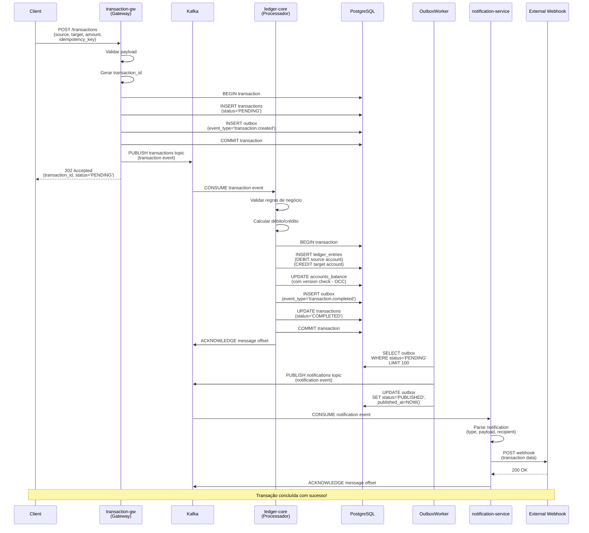
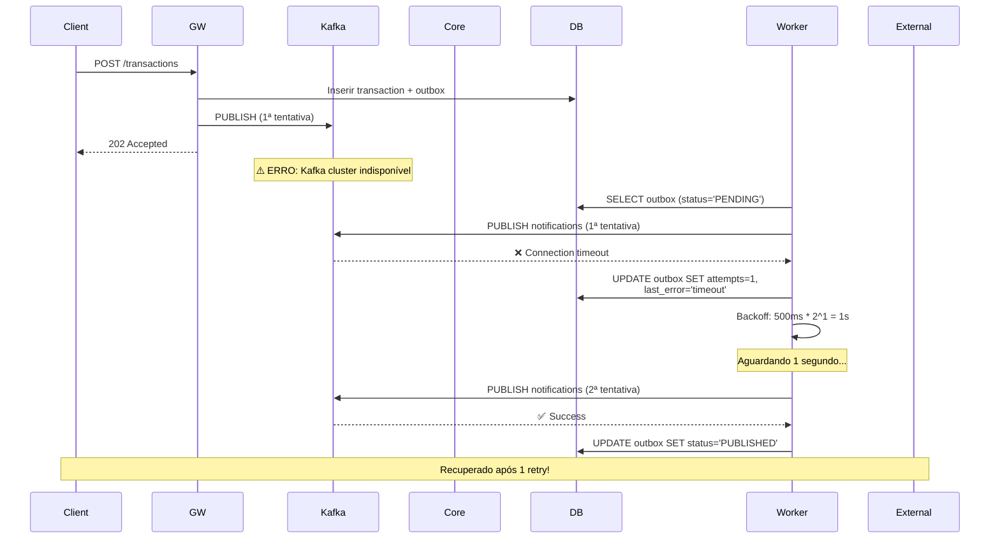
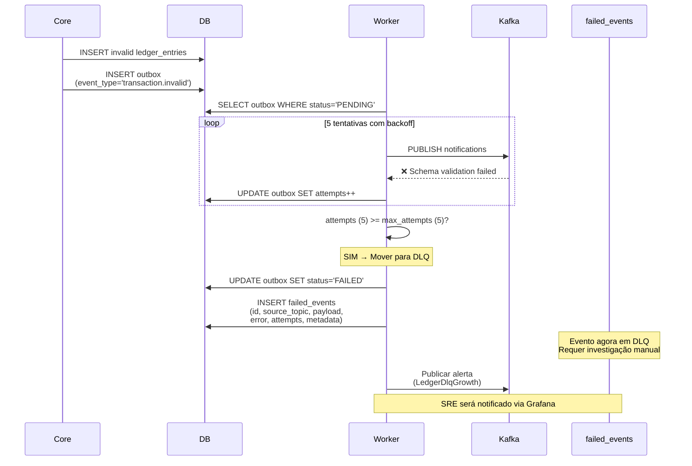
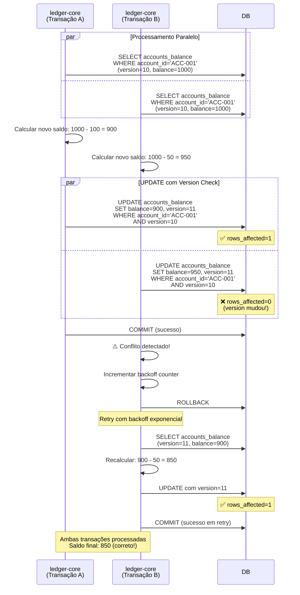
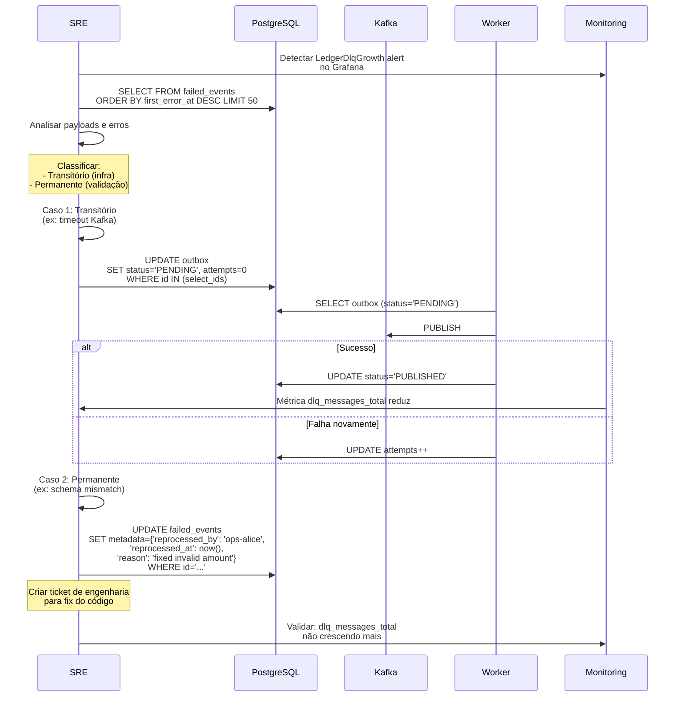
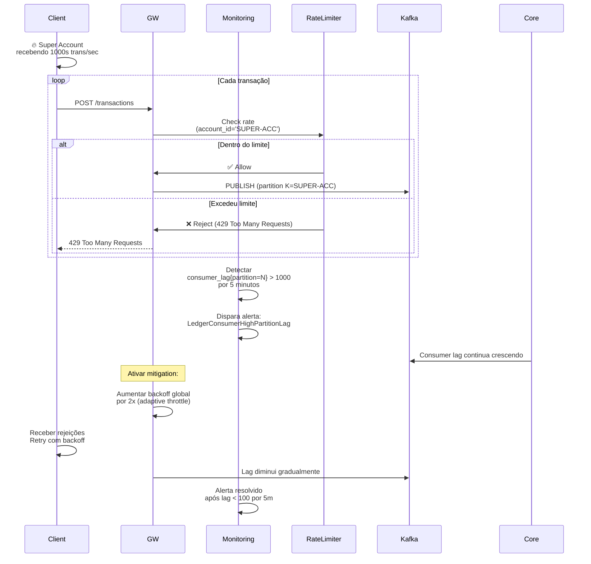
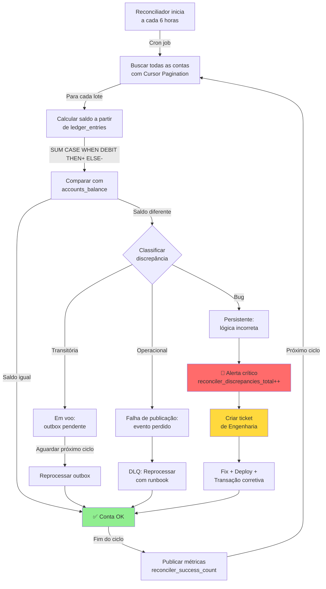
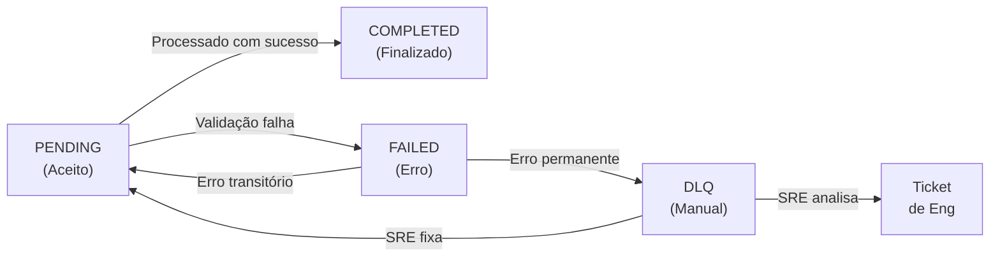

# Architecture Flows — Diagramas de Fluxo End-to-End

**Propósito:** Visualizar o fluxo completo de uma transação através dos componentes do sistema, incluindo caminhos de sucesso, erro e recuperação.

**Última atualização:** 2026-06-24

---

## 1. Fluxo de Transação Bem-Sucedida (Happy Path)

Este é o cenário esperado quando uma transação é processada sem erros.

**Tempo total esperado:** < 2 segundos (SLA)

**Verificação de sucesso:**
- ✅ `transactions.status` = `COMPLETED`
- ✅ `ledger_entries` contém 2 registros (débito + crédito balanceados)
- ✅ `accounts_balance` atualizado para ambas as contas
- ✅ `outbox.status` = `PUBLISHED`
- ✅ Cliente recebe webhook de notificação

---

## 2. Fluxo de Erro Transitório (Retry com Sucesso)

Quando um componente falha temporariamente mas se recupera após retry.

**Parâmetros de retry:**
- `max_attempts` = 5
- `initial_backoff` = 500ms
- `backoff_multiplier` = 2
- `max_backoff` = 30s
- `jitter` = ±10% aleatório

**Quando isso acontece:**
- Kafka indisponível temporariamente
- Database connection pool esgotado
- Timeout de rede (network timeout)
- Rate limit temporário de webhook externo

---

## 3. Fluxo de Erro Permanente (Para DLQ)

Quando o erro persiste após max_attempts e a mensagem vai para Dead Letter Queue.

**Exemplo de erro permanente:**
- Schema mismatch (campo obrigatório faltando)
- Validação de negócio falha (saldo negativo)
- Conta de origem ou destino inválida
- Webhook externo retorna 410 Gone (cliente deletado)

**Operação manual necessária:**
- SRE investiga payload em `failed_events`
- Determina causa: bug no código vs dados ruins
- Se dados ruins: corrigir manualmente em metadata
- Se bug: fix, deploy, reprocessar

---

## 4. Fluxo de Conflito de Concorrência (OCC - Optimistic Concurrency Control)

Quando duas transações tentam atualizar a mesma conta simultaneamente.

**Garantia:** A version check (OCC) garante que não há "lost updates" — cada transação vê a versão correta da conta.

**Quando isso acontece:**
- Múltiplas transações na mesma conta
- Particularmente com hot accounts (contas muito ativas)
- Exemplo: Conta compartilhada recebendo múltiplos pagamentos

---

## 5. Fluxo de Reprocessamento de DLQ (Operacional)

Como um SRE/Ops reprocessa eventos que falharam.

**Runbook associado:** [`playbooks/dlq-playbook.md`](playbooks/dlq-playbook.md)

---

## 6. Fluxo de Hot Partition (Estrangulamento)

Como o sistema detecta e mitiga uma "hot partition" (uma partição Kafka recebendo muito tráfego).

**Quando ativar:**
- Consumer lag > 1000 por > 5m
- Taxa de erro > 1% durante > 10m
- `transaction_processing_duration_seconds` p95 > 5s

**Estratégias de mitigação:**
1. **Rate Limiting** — Throttle cliente (429 Too Many Requests)
2. **Sharding** — Splittar super account em subcontas
3. **Escalar consumers** — Adicionar mais replicas (se stateless)
4. **Reroute** — Enviar para partição alternativa (se suportado)

---

## 7. Fluxo de Reconciliação (Auditoria em Lote)

Como o reconciliador detecta e classifica discrepâncias.

**Tempos:**
- Cada ciclo: ~30 min (depende do volume)
- Detecção de discrepância: < 1h após acontecer
- Classificação: manual via SRE/Ops
- Resolução: 24h (SLA de negócio)

**Métricas:**
- `reconciler_cycles_total`
- `reconciler_discrepancies_total`
- `reconciler_cycle_duration_seconds`

---

## 8. Referência Rápida de Estados

**Estados por tabela:**

| Tabela | Status | Significado |
|--------|--------|-------------|
| `transactions` | PENDING | Em processamento |
| `transactions` | COMPLETED | Processada com sucesso |
| `transactions` | FAILED | Validação ou erro permanente |
| `outbox` | PENDING | Aguardando publicação no Kafka |
| `outbox` | PUBLISHED | Publicada com sucesso |
| `outbox` | FAILED | Excedeu max_attempts, movida para DLQ |
| `failed_events` | N/A | Evento permanentemente falhado |

---

## 9. Links para Documentação Detalhada

| Fluxo | Documentação |
|-------|--------------|
| Happy Path | `system-design.md` § 1) Arquitetura |
| Erro & DLQ | `playbooks/dlq-playbook.md` |
| OCC & Concorrência | `reference/faq.md` § 1) Consistência |
| Hot Partition | `playbooks/operations-runbooks.md` § 1) |
| Reconciliação | `reference/faq.md` § 3) Escalabilidade |
| Idempotência | `reference/operational-compliance-policy.md` § 3) |

---

## 10. Troubleshooting por Sintoma

| Sintoma | Provável Causa | Fluxo | Ação |
|---------|----------------|-------|------|
| Transação fica em PENDING | Processador não está rodando | 1 | Reiniciar ledger-core |
| Muitos eventos em DLQ | Bug no código ou schema inválido | 3 | Investigar failed_events |
| Consumer lag alto | Hot partition ou processador lento | 6 | Escalar consumers ou mitigar throttle |
| Discrepância de saldo | Outbox event perdido ou bug | 7 | Executar reconciliador |
| OCC conflict persistente | Muita contention na mesma conta | 4 | Considerar sharding de conta |

---

**Versão:** 1.0  
**Última atualização:** 2026-06-24  
**Próxima revisão:** 2026-08-01  
**Proprietário:** Staff Engineering / Architecture Guild
