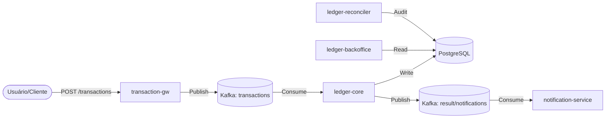

# System Design — Distributed Ledger (Consolidado)

Status: Aprovado pelo Staff (Acionável)
Proprietário: Staff Engineering
Última atualização: 2026-06-23

Objetivo

Este design de sistema consolidado é a referência técnica canônica para engenharia e SRE. Contém arquitetura, modelo de dados (DDL), contratos de eventos, parâmetros operacionais (idempotência, retry/DLQ), SLOs e runbooks curtos.

1) Arquitetura de alto nível



- API / Gateway de Transação (`transaction-gw`): valida requisições, canonicaliza a `idempotency_key`, escreve a linha de `transactions` + `outbox` dentro da mesma transação de banco de dados.
- Rate limiter: Baseado em Redis com contadores atômicos via script e fallback local.
- Broker: Tópicos Kafka (`transactions`, `transaction_result`, `notifications`, `<topic>-dlq`). Chaveamento padrão por `account_id` para preservar a ordenação por conta.
- Processador (`ledger-core`): consome `transactions`, aplica regras de domínio, escreve `ledger_entries`, atualiza `accounts_balance` (concorrência otimista) e persiste linhas de outbox para eventos a jusante.
- Worker de Outbox: publica linhas de `outbox` no Kafka, marca como `PUBLISHED` ou `FAILED`. Em falhas repetidas, escreve em `failed_events`.
- Serviço de Notificação (`notification-service`): consome eventos de `notifications` e encaminha para provedores externos (Webhooks, E-mail, Push).
- Backoffice (`ledger-backoffice`): interface administrativa para consulta de saldos, extratos e gestão de contas, acessando diretamente a réplica de leitura do banco de dados.
- Reconciliador (`ledger-reconciler`): job em lote que calcula saldos a partir de `ledger_entries` e os compara com `accounts_balance`.

2) Modelo de dados central (trechos de DDL)

Transações (Transactions)

```sql
CREATE TABLE transactions (
  id UUID PRIMARY KEY,
  idempotency_key VARCHAR(255) UNIQUE NOT NULL,
  description TEXT,
  status VARCHAR(20) NOT NULL DEFAULT 'COMPLETED',
  metadata JSONB,
  created_at timestamptz NOT NULL DEFAULT now(),
  updated_at timestamptz NOT NULL DEFAULT now()
);
```

Lançamentos de Ledger (Ledger entries)

```sql
CREATE TABLE ledger_entries (
  id UUID PRIMARY KEY,
  transaction_id UUID NOT NULL REFERENCES transactions(id),
  account_id UUID NOT NULL,
  entry_type VARCHAR(10) NOT NULL CHECK (entry_type IN ('DEBIT','CREDIT')),
  amount_in_cents BIGINT NOT NULL CHECK (amount_in_cents > 0),
  created_at timestamptz NOT NULL DEFAULT now()
);
CREATE INDEX idx_ledger_entries_account_created ON ledger_entries (account_id, created_at DESC);
```

Saldo das Contas (Accounts balance - projeção)

```sql
CREATE TABLE accounts_balance (
  account_id UUID PRIMARY KEY,
  balance_in_cents BIGINT NOT NULL DEFAULT 0,
  version BIGINT NOT NULL DEFAULT 0,
  updated_at timestamptz NOT NULL DEFAULT now()
);
```

Outbox e eventos com falha

```sql
CREATE TABLE outbox (
  id UUID PRIMARY KEY,
  aggregate_type VARCHAR(100) NOT NULL,
  aggregate_id UUID NULL,
  event_type VARCHAR(100) NOT NULL,
  payload JSONB NOT NULL,
  status VARCHAR(20) NOT NULL DEFAULT 'PENDING',
  attempts INT NOT NULL DEFAULT 0,
  last_error TEXT NULL,
  created_at timestamptz NOT NULL DEFAULT now(),
  published_at timestamptz NULL
);

CREATE TABLE failed_events (
  id UUID PRIMARY KEY,
  source_topic VARCHAR(255),
  payload JSONB NOT NULL,
  error TEXT NOT NULL,
  attempts INT NOT NULL DEFAULT 0,
  first_error_at timestamptz NOT NULL DEFAULT now(),
  last_error_at timestamptz NOT NULL DEFAULT now(),
  metadata JSONB NULL
);
```

3) Contratos de eventos (resumo)

- Use registro de esquemas (Avro/Protobuf/JSON Schema). Adicione `schema_version` nos headers e imponha compatibilidade via CI.
- Chaveie mensagens por `source_account_id` para garantir a ordenação por conta.

Tópico de Transações (intenção)

```json
{
  "id": "tx-123",
  "source_account_id": "acc-A",
  "target_account_id": "acc-B",
  "amount": 2500,
  "idempotency_key": "req-abc",
  "description": "Transferência simples",
  "created_at": "2026-06-23T21:40:19Z"
}
```

Resultado da Transação (Notificação)

```json
{
  "id": "not-123",
  "type": "transaction_processed",
  "target": "acc-A",
  "payload": "Transação de R$ 25.00 processada com sucesso."
}
```

4) Parâmetros operacionais

- Idempotência: `idempotency_key` obrigatória para todas as requisições de transação externas. Imposta no nível do banco de dados (`UNIQUE`). TTL sugerido = 30 dias (Pendente de confirmação por Produto/Compliance).
- Política de Retry: `max_attempts = 5`, `initial_backoff = 500ms`, `multiplier = 2`, `max_backoff = 30s` + jitter.
- DLQ: mover para `<topic>-dlq` e inserir em `failed_events` após exceder os retries. Retenção sugerida = 90 dias (Pendente de confirmação).

5) Modelo de consistência

- Use transações locais fortes para atualizações financeiras: insira `transactions`, `ledger_entries` e a linha de `outbox` de forma atômica.
- Use concorrência otimista (`version`) para atualizações de `accounts_balance`.
- Evite transações distribuídas; conte com o padrão outbox para consistência eventual entre serviços.

6) Observabilidade e SLOs

- Métricas a expor: `transactions_processed_total`, `transactions_processed_errors_total`, `transaction_processing_duration_seconds`, `outbox_pending`, `dlq_messages_total`, `consumer_lag{topic,partition}`, `reconciler_discrepancies_total`, `transaction_rate_by_account`.
- SLOs sugeridos: 99,9% das transações processadas em < 2s; 99,99% de disponibilidade do serviço.

7) Runbooks (resumo)

- Reprocessamento de DLQ: reprocessar pequenos lotes via `FOR UPDATE SKIP LOCKED`; anexar metadados `reprocessed_by` e parar se a taxa de erro a jusante aumentar além do limite.
- Partições quentes (hot partitions): detectar via `consumer_lag` por partição; dimensionar consumidores, aplicar throttling por conta, considerar sharding/subcontas para contas muito ativas.
- Reconciliador: processamento baseado em cursor em blocos, classificar discrepâncias (transitórias/operacionais/bug) e criar tickets de remediação ou transações corretivas.

8) Governança e ciclo de vida

- Mudanças de esquema requerem: diff de esquema, validação de compatibilidade, plano de migração, plano de atualização de consumidores e verificações de CI. Publique artefatos canônicos em `/schema/`.
- Proprietários: API Guild para esquemas, Ledger Team para lógica central, SRE/Plataforma para runbooks/alertas, Produto/Compliance para retenção e SLAs.

9) Segurança e conformidade

- Mascarar PII em logs e dashboards. Use Vault para credenciais e controle de acesso para operações de reprocessamento.
- Manter trilha de auditoria: todas as escritas são apenas de acréscimo (append-only); correções apenas por transações de compensação.

10) Exemplos e padrões rápidos

- Inserção de transação idempotente:

```sql
INSERT INTO transactions (id, idempotency_key, status, metadata)
VALUES ($1, $2, 'PENDING', $3)
ON CONFLICT (idempotency_key) DO NOTHING
RETURNING id, status, created_at;
```

- Selecionar lote de outbox pendente com lock:

```sql
BEGIN;
SELECT id, payload FROM outbox WHERE status='PENDING' ORDER BY created_at LIMIT 100 FOR UPDATE SKIP LOCKED;
COMMIT;
```

11) Log de Decisões (Staff Engineering)

- Decisão: Chaveamento (Keying) por `account_id` no Kafka
  - Fundamentação: garante ordenação por conta
  - Ação: monitorar hot-partitions e criar playbook de sharding (Proprietário: Staff Eng, ETA: 1 sprint)

- Decisão: `idempotency_key` UNIQUE em `transactions`
  - Fundamentação: evita duplicidade financeira
  - Ação: implementar job de limpeza de TTL e documentar política de 30 dias (Proprietário: Ledger Team, ETA: 1 sprint)

- Decisão: Padrão Outbox + worker
  - Fundamentação: garantir publicação at-least-once sem bloquear transações
  - Ação: finalizar DDL e políticas de retry/DLQ (Proprietário: Plataforma, ETA: 1 sprint)

- Decisão: Multi-moeda adiada
  - Fundamentação: reduzir escopo inicial
  - Ação: criar épico `multi-currency` com opção de mitigação de hot-partition e análise de sharding (Proprietário: Produto + Staff, ETA: Q4 planning)

12) Padrões de Arquitetura e Código

- **Arquitetura Hexagonal (Ports & Adapters):** Todos os serviços devem isolar a lógica de negócio (core/domain) de preocupações externas (HTTP, Kafka, Postgres). Isso facilita testes unitários e trocas de infraestrutura.
- **SOLID:** Princípios de responsabilidade única e inversão de dependência são mandatórios para garantir a manutenibilidade do monorepo.
- **Tratamento de Erros:** Erros devem ser tipados e contextuais, utilizando `fmt.Errorf` com wrap (`%w`) e verificados com `errors.Is` ou `errors.AsType`.

---

Este `system-design.md` condensado deve ser lido junto com `business.md` e `dev-team.md` para planejamento, implementação e operações.

Guias Detalhados:
- [Guia de Idempotência](reference/idempotency-guide.md)
- [Guia de Observabilidade](reference/observability.md)
- [Contratos Técnicos](reference/technical-contracts.md)
- [Política Operacional e de Conformidade](reference/operational-compliance-policy.md)
